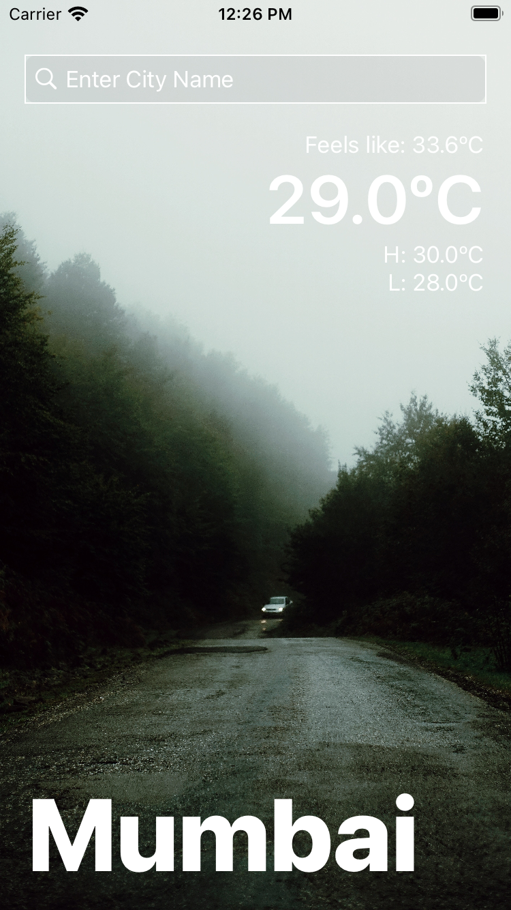

# Open-Weather
An iOS Application to fetch and store weather data.

<b>Features</b>
- Fetches weather data for searched city and stores it in database (Realm Database). 
- When same city is searched before 24hrs time interval, the weather data is loaded from the database. 
- The weather data in database is deleted after 24hrs.

## Screenshot

## Technologies Used
- Swift Programming Language
- UIKit
- Storyboard
- CocoaPods
- RealmDB

## Credits
- <a href="https://developer.apple.com/documentation"> Apple Developer Documentation </a>
